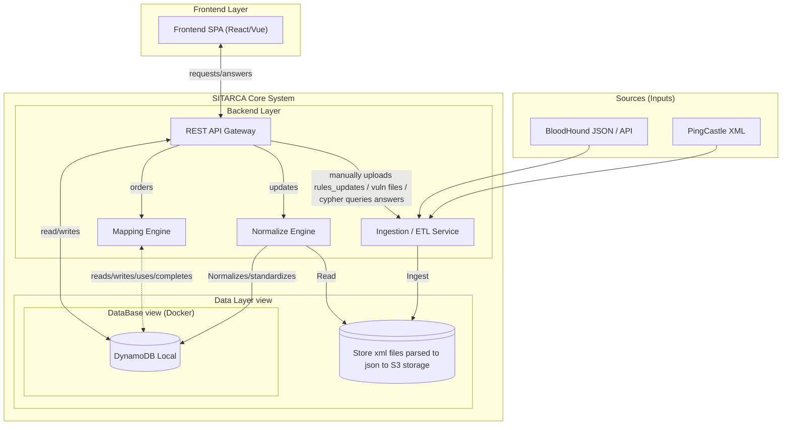
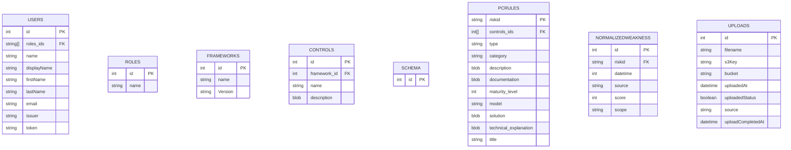

# Sitarca - High Level Architecture (HLA)

Ce document décrit l'architecture logique et les flux de données de la plateforme Sitarca (Version Identity Focus).

## 1. Diagramme de Composants

L'architecture repose sur le pattern "Hexagonal" (Ports & Adapters) simplifié en trois tiers.

---

## 2. Description des Flux de Données

### A. Flux d'Ingestion (La "Pierre de Rosette")

C'est l'étape critique où la donnée technique devient "intelligible" pour le métier.

1. **Collection** : Les fichiers (Rapport XML PingCastle ou Exports JSON Bloodhound) sont déposés ou
   récupérés par le service d'ingestion.
2. **Parsing** :
   * PingCastle Parser extrait les `HealthCheck` et `RiskRules`.
   * Bloodhound Parser analyse les `Nodes` et `Edges` pour identifier les "High Value Targets" exposées.
3. **Normalisation** : Chaque entrée est convertie en objet JSON standardisé `SitarcaFinding`.
   * _Exemple_ : Une règle PingCastle "LAPS not enabled" et un nœud Bloodhound "LAPS readable" deviennent
      tous deux des Findings de type `IdentityWeakness`.

### B. Flux de Mapping (L'Intelligence)

Ce processus transforme la liste de problèmes techniques en tableau de bord de gouvernance.

1. **Chargement** : Le moteur lit les `SitarcaFinding` normalisés.
2. **Matching** : Il parcourt la table de règles (`/data/translation_rules`).
   * _Condition_ : SI `Finding.Tags` contient "Kerberos" ET `Finding.Severity` > 70...
   * _Action_ : ... ALORS marquer le contrôle `NIST PR.AC-3` comme "EN ÉCHEC".
3. **Calcul** : Le moteur agrège les résultats pour produire un score de conformité par Framework.

## 3. Choix Technologiques (Préconisations)

* **Data Serialization** : JSON (Strict Schemas via Pydantic ou TypeBox).
* **Backend** : Python (FastAPI) pour sa facilité de manipulation de données et bibliothèques graph
  (NetworkX) si besoin d'analyser les chemins Bloodhound.
* **Frontend** : React ou Vue.js.
* **Stockage (V1)** : Système de fichiers structuré (JSON files) pour faciliter la portabilité
  "Entreprise". Pas de base de données lourde (PostgreSQL) requise pour la V1.
